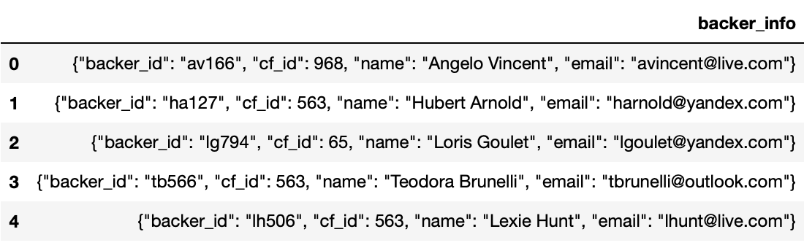
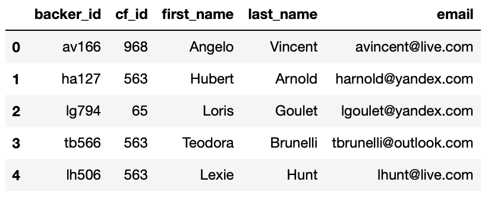

# ETL
Extract-Transform-Load

## Overview 

This project is focused on the process of colleting, cleaning and finally making use of the valuable insight of the data. 
First, we extracted and put the information on a data frame. After correcting the data types, it now allow us to make relationships when we import it to an structured query language.

Loading the data and making entity relationships between the tables, makes it posible to evaluate rapidly, retrieve information from extense datasets and save it into new datasets. 

## Results 

Cleaning the data allow us to make this:

Turn into this: 

A more visually friendly approach to collect the information to use it with a query language program. 

  
  
